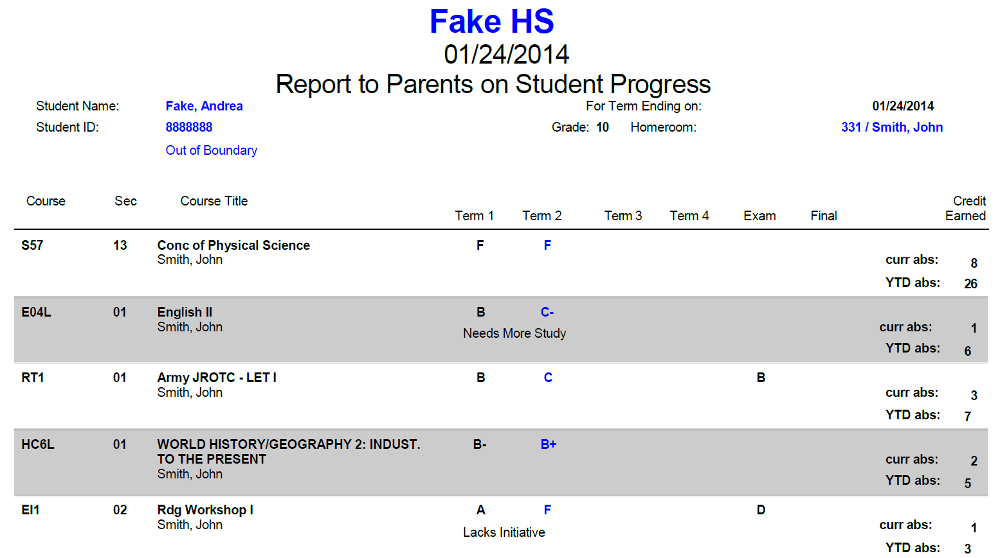

<!--
%\VignetteEngine{knitr}
%\VignetteIndexEntry{Introduction to laycReportCards}
-->


# Introduction to laycReportCards

This package was designed as an internal package for LAYC (www.layc-dc.org). Its main goal is to facilitate the collection of students' academic information. This package parses DC report cards and returns students academic information in tabular format (R data.frame). The main function is get_rcards(). This function takes a report card in pdf file format as input, and returns a table containing the pdf information. 
The function requires the pdf file to be in a specific format: Please see the "students_progess.pdf" file in the package "data-raw" folder to check accepted format.

## Example

Our goal is to extract students' academic information contained in the "students_progress.pdf" file. Here is a glimpse of the pdf file:    



### Parse the PDF file & Save the output in a data.frame called "school_data""


```r
library(laycReportCards)
school_data <- get_rcards('../data-raw/students_progress.pdf')
```

### Print the first rows and columns of school_data

```r
head(school_data[ , 2:11])
```


```
#>    fname lname grade gpa1 gpa2 gpa3 gpa4 cumgpa abs_excused abs_unexcused
#> 1   John  Fake    12 3.18 2.95 <NA> <NA>   3.38           4             4
#> 2 Andrea  Fake    10 2.10 1.47 <NA> <NA>   1.18           4             4
#> 3  Sarah  Fake    10 3.73 3.43 <NA> <NA>   3.16           1             1
#> 4 Justin  Fake    10 1.74 2.00 <NA> <NA>   1.57           2             2
```

